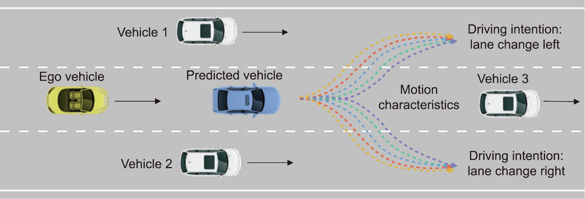
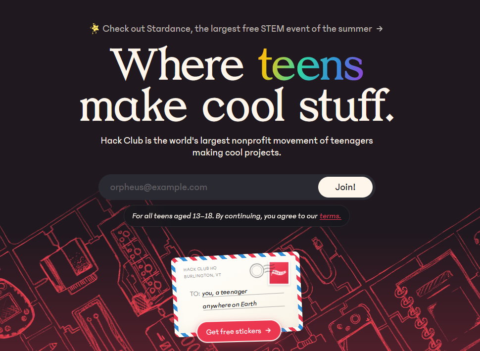

<br>

# 🚗 Self-Driving Car Simulation

A simulation of a **Self-Driving Car** that avoids traffic and collisions using a Neural Network and Machine Learning.
Uses a <HTML5> Canvas with pure **Vanilla Javascript** without any use of external AI/ML or physics libraries.
The car is learns how to navigate through simulated highway traffic using:

- **Ray-Casting Distance Sensors**
- **Collision Physics**
- **An Artificial Neural Network**

The project has been inspired by **Dr. Radu Mariescu-Istodor's** [ Self-Driving Car with JavaScript Course – Neural Networks and Machine Learning ](https://youtu.be/Rs_rAxEsAvI).


<br>

### 🎯 Goal of the Project
This project is covers the fundementals of **AI/ML** and **Neural Networks**. Alongside, providing hands-on experience in translating real-life solutions into functional JavaScript code.

Most importantly, this is a project for [HackClub.com](https://hackclub.com)



### 🛠️ Tech Stack & Concepts
* **Language:** Pure Vanilla JavaScript (ES6+)
* **Rendering:** HTML5 Canvas API
* **Mathetmatics:** Linear interpolation (Lerp), coordinate geometry, segment intersection algorithms
* **Logic:** Neural Network with customizable mutation rates

[](#)
[](#)

### 💻 How to Run the Simulation

### 1. Clone the Repository
```bash
git clone https://github.com/lolnypop/SelfDrivingCar
cd SelfDrivingCar
```

### 2. Launch the Application
Since the project uses no external libraries or bundlers, you can run it directly in your browser:
* Open the `index.html` file directly in your browser
* That's it. Enjoy!

## Author
* **Fahian Rasheed** - *A Personal Project By* - [@lolnypop](https://github.com/lolnypop)
* I enjoy making projects and attending hackathons

[](https://twitter.com/fahianrasheed)
[](https://instagram.com/fahianrasheed)


## License
This repository and its contributions are licensed under the [**MIT License**](./LICENSE)
